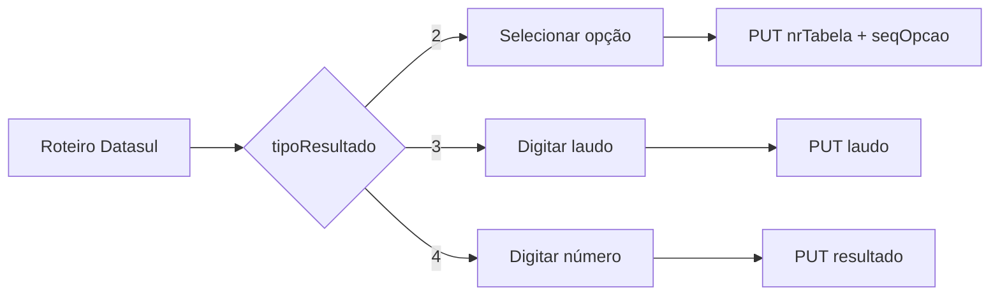

# Incidente: resultado de exame tipo 3 enviado como número

- **Data:** 2026-08-14
- **Módulo:** Plano Controle CQ
- **Integração:** `PUT /api/fcq/v1/resultexames?companyId={companyId}`
- **Status:** causa-raiz confirmada e correção implementada; publicação e tratamento da pendência antiga ainda necessários

## Resumo

Um resultado do componente 10, exame 2000, permaneceu na Outbox e acumulou mais de 24 tentativas. O navegador enviava `resultado: 0` ao gateway da aplicação, que encaminhava o PUT ao Datasul e recebia `500 Internal Server Error`.

A investigação comprovou que o transporte, o proxy e resultados numéricos válidos continuavam funcionando. O problema era a interpretação de `tipoResultado: 3`: esse tipo exige o campo textual `laudo`, mas a aplicação o tratava como resultado numérico sempre que o componente não possuía opções tabeladas.

## Impacto observado

- uma medição inválida ficou em `RETRY_WAIT` e continuou gerando chamadas automáticas;
- a Central de Sincronização mostrou a pendência com tentativas crescentes;
- o navegador recebeu respostas `500` e, em algumas tentativas, `504` por timeout;
- a interface exibiu `0 - 0` como referência, embora esses limites não fossem uma faixa útil para o componente tipo 3;
- novas medições numéricas válidas continuaram sincronizando; o valor `347` foi confirmado com sucesso.

## Evidências

### Roteiro retornado pelo Datasul

```json
{
  "resultadoMin": 0.0,
  "resultadoMax": 0.0,
  "nrTabela": 0,
  "codComponente": 10,
  "codExame": 2000,
  "tipoResultado": 3,
  "referenciaTecnica": "",
  "descricao": "ESPESSURA CHAPA CONF. DESENHO"
}
```

### Payload incorreto produzido pela aplicação

```json
{
  "nrFicha": 64391,
  "codExame": 2000,
  "codComponente": 10,
  "resultado": 0
}
```

O gateway acrescentava `codUsuario` a partir da sessão antes de encaminhar o corpo ao Datasul.

### Resposta direta do Datasul sem laudo

```json
{
  "detailedMessage": "Laudo e obrigatório para tipo-result=3",
  "code": "5",
  "message": "Laudo e obrigatório para tipo-result=3",
  "type": "error"
}
```

O Datasul respondeu com HTTP 500, embora a causa fosse uma validação funcional.

### Confirmação do contrato

O teste no Postman que acrescentou `laudo: "0"` retornou HTTP 200 e `componentesSalvos: 1`. A requisição observada ainda mantinha `nrTabela: 8` e `seqOpcao: 1` de um teste anterior. Em conjunto com a mensagem explícita da tentativa sem laudo, a comparação confirmou que o texto `"0"` é válido e que a ausência de `laudo` provocava a rejeição.

Os campos de tabela eram residuais e não devem ser reproduzidos no fluxo tipo 3. O corpo canônico adotado pela aplicação envia somente `laudo` como representação do resultado.

## Causa-raiz

O frontend distinguia os componentes apenas pela presença de `opcoesResultado`:

- com opções: enviava `nrTabela` e `seqOpcao`;
- sem opções: tratava como numérico e enviava `resultado`.

Essa bifurcação não contemplava `tipoResultado: 3`. O componente era descritivo, exigia `laudo` e não deveria passar por sanitização numérica, validação de casas decimais ou comparação com `resultadoMin` e `resultadoMax`.



## Correção implementada

| Tipo | Entrada da interface | Representação no PUT |
| --- | --- | --- |
| 2 | Opção de uma tabela | `nrTabela` e `seqOpcao` |
| 3 | Texto no campo **Laudo** | `laudo` |
| 4 | Medição numérica | `resultado` |

Também foram corrigidos os seguintes pontos:

- componentes tipo 3 sem `referenciaTecnica` não exibem mais `0 - 0` como referência;
- o laudo é preservado no modelo local, na Outbox e na restauração offline;
- gateway e sincronizador validam uma única representação de resultado por comando;
- o valor `"0"` permanece válido porque é texto não vazio;
- os fluxos existentes dos tipos 2 e 4 foram preservados.

## Verificação automatizada

- testes focados do mapper, painel, sincronizador e gateway: 31 aprovados;
- suíte completa: 96 arquivos e 923 testes aprovados;
- build de produção concluído;
- avisos remanescentes, não introduzidos pela correção: orçamento do bundle inicial e dependência CommonJS `js-sha256`.

## Pendência operacional anterior à correção

O comando antigo foi persistido com `resultado: 0`. Atualizar a aplicação não reescreve comandos já armazenados na Outbox. Como o mesmo resultado foi registrado diretamente pelo Postman, a entrada antiga deve ser abandonada ou substituída de forma controlada quando houver permissão homologada.

Não se deve limpar toda a IndexedDB nem apagar a Outbox indiscriminadamente, pois outros registros pendentes podem pertencer ao operador.

## Validação após publicação

1. Publicar a versão corrigida e atualizar o servidor.
2. Gerar uma nova ficha contendo componente `tipoResultado: 3`.
3. Confirmar que a tela apresenta **Laudo** e referência `-` quando `referenciaTecnica` estiver vazia.
4. Informar `0` e salvar.
5. Confirmar no Network que o gateway recebeu `laudo: "0"`, sem `resultado`, `nrTabela` ou `seqOpcao`.
6. Confirmar HTTP 200 e reconciliação da Outbox para o novo comando.
7. Tratar separadamente a pendência antiga criada antes da correção.

## Aprendizados

- Ausência de opções tabeladas não implica resultado numérico.
- Códigos discriminadores retornados pelo Datasul precisam ser tratados explicitamente.
- Limites zerados não devem ser apresentados como referência quando o tipo de resultado não utiliza faixa numérica.
- Um HTTP 500 do Datasul pode representar rejeição funcional; retries ilimitados podem transformar um payload inválido em uma pendência permanente.

## Referência relacionada

- [Contrato de Resultados de exames](../result-exames.md)
